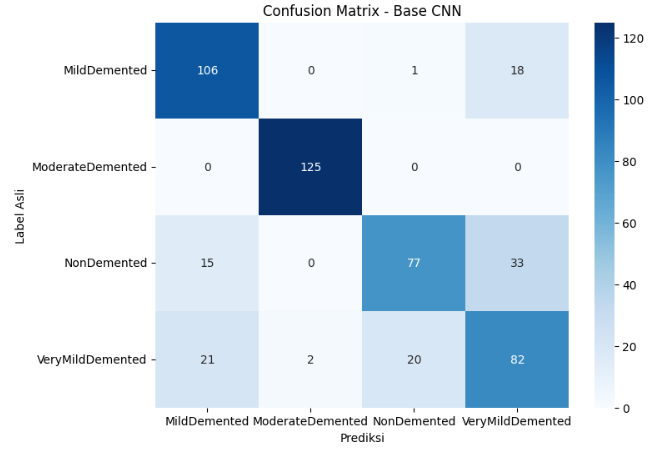
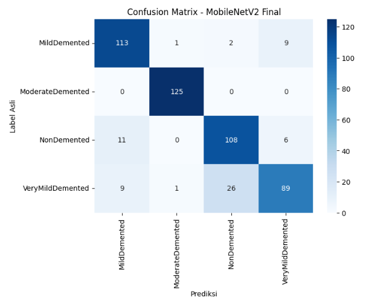
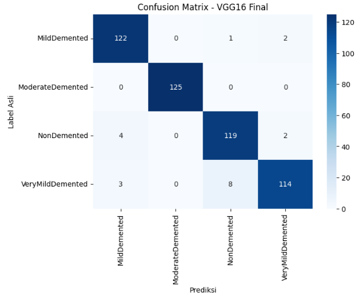
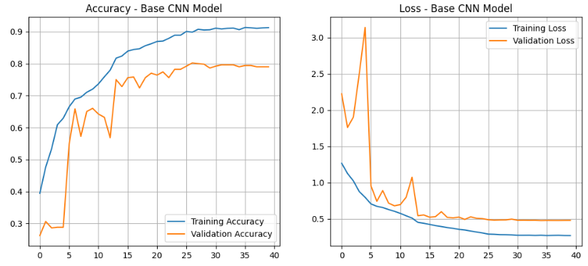
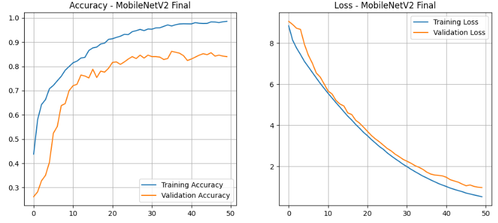
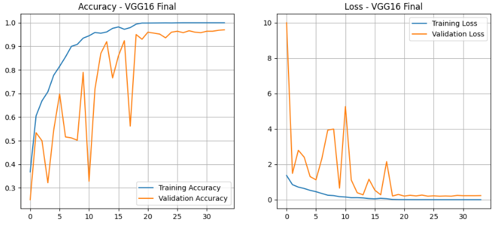
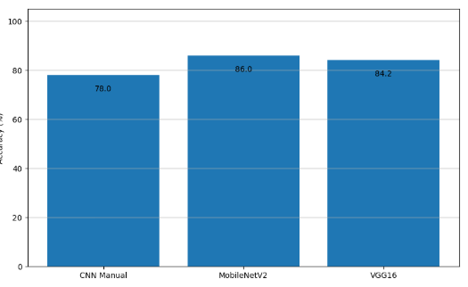
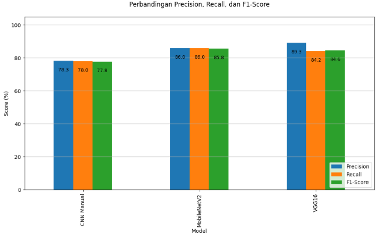

<h1 align="center">Alzheimer Brain MRI Classification</h1>
---

  

  Sumber Image : <a href="https://www.shutterstock.com/image-photo/haze-brain-alzheimer-600nw-2651172251.jpg">Access Here</a>

---

<h1 align="center">📑 Table of Contents 📑</h1>

- [Deskripsi Proyek](#deskripsi-proyek)
- [Latar Belakang](#latar-belakang)
- [Tujuan Pengembangan](#tujuan-pengembangan)
- [Sumber Dataset](#sumber-dataset)
- [Preprocessing dan Pemodelan](#preprocessing-dan-pemodelan)
  - [Preprocessing Data](#preprocessing-data)
  - [Pemodelan](#pemodelan)
- [Hasil & Evaluasi](#hasil--evaluasi)
- [Dashboard](#dashboard)

---

<h1 id="deskripsi-proyek" align="center">🧠 Klasifikasi Penyakit Alzheimer 🧠</h1>

Proyek ini berfokus pada pengembangan sistem klasifikasi otomatis untuk mendeteksi tingkat keparahan penyakit Alzheimer berdasarkan citra medis MRI (Magnetic Resonance Imaging). Dengan memanfaatkan teknik pemrosesan citra dan kecerdasan buatan, proyek ini bertujuan untuk membantu proses skrining awal dalam membedakan berbagai stadium atrofi otak.

Model ini dilatih untuk mengklasifikasikan citra MRI ke dalam 4 kategori klinis:

- **Non Demented** → Kondisi otak normal tanpa indikasi demensia.
- **Very Mild Demented** → Indikasi awal gejala demensia yang sangat ringan.
- **Mild Demented** → Gejala demensia tingkat ringan dengan perubahan struktural otak yang mulai terlihat.
- **Moderate Demented** → Penurunan fungsi kognitif dan atrofi otak tingkat sedang.

Untuk mendapatkan hasil klasifikasi yang paling akurat, penelitian ini menguji tiga pendekatan arsitektur Deep Learning yang berbeda:

- **1. Custom CNN (Baseline Model)**
- **2. MobileNetV2 (Transfer Learning & Fine-Tuning)**
- **3. VGG16 (Advanced Transfer Learning)**

---

<h1 id="latar-belakang" align="center">🧠 Latar Belakang 🧠</h1>

Penyakit Alzheimer merupakan gangguan neurodegeneratif progresif yang menjadi penyebab paling umum dari demensia di seluruh dunia. Penyakit ini menyebabkan penyusutan sel otak secara bertahap (atrofi), yang berdampak pada penurunan daya ingat, kemampuan berpikir, hingga perubahan perilaku secara drastis.
Tantangan utama dalam penanganan Alzheimer adalah gejalanya yang seringkali dianggap sebagai proses penuaan normal pada tahap awal (Very Mild Demented). Padahal, intervensi medis akan jauh lebih efektif jika dilakukan sebelum kerusakan otak meluas ke stadium lanjut (Moderate Demented).
Penggunaan citra Magnetic Resonance Imaging (MRI) merupakan salah satu standar emas untuk melihat perubahan struktur otak. Namun, menganalisis ratusan scan MRI secara manual memerlukan ketelitian tinggi, waktu yang lama, dan keahlian spesialis radiologi yang terbatas jumlahnya.

Proyek ini hadir untuk menjawab tantangan tersebut dengan memanfaatkan teknologi Deep Learning. Dengan menggunakan model Custom CNN, MobileNetV2, dan VGG16, sistem ini dikembangkan untuk:

- Otomatisasi Skrining: Membantu tenaga medis dalam melakukan klasifikasi stadium Alzheimer secara cepat dan objektif.
- Deteksi Dini: Mengidentifikasi pola halus pada citra MRI yang mungkin terlewatkan dalam observasi visual manual, terutama pada fase Very Mild.
- Akurasi Diagnostik: Memberikan perbandingan performa antara arsitektur model konvensional dan Transfer Learning untuk mendapatkan hasil klasifikasi yang paling reliabel.

Melalui pendekatan ini, diharapkan proses pemantauan kesehatan saraf pasien dapat dilakukan secara lebih efisien, mendukung keputusan klinis yang lebih tepat, dan membantu perencanaan perawatan pasien dengan lebih baik.

---

<h1 id="tujuan-pengembangan" align="center">🎯 Tujuan Pengembangan 🎯</h1>

- **Mengembangkan sistem klasifikasi citra MRI otak untuk mendeteksi penyakit Alzheimer secara otomatis ke dalam 4 kategori: Non Demented, Very Mild Demented, Mild Demented, dan Moderate Demented.**
- **Mengevaluasi dan membandingkan performa tiga arsitektur Deep Learning, meliputi:**
  - **Custom CNN**: Menguji efektivitas model yang dibangun dari awal dengan lapisan konvolusi mandiri.
  - **MobileNetV2**: Menguji performa model pre-trained yang ringan dan efisien menggunakan teknik partial fine-tuning pada 20 layer terakhir.
  - **VGG16**: Menguji kekuatan arsitektur yang lebih dalam dengan melakukan fine-tuning spesifik pada Block 4 dan Block 5 untuk menangkap detail tekstur otak yang kompleks.
- **Mengoptimalkan akurasi model melalui teknik Transfer Learning dan Fine-Tuning, guna mengatasi keterbatasan data medis dan meningkatkan kemampuan generalisasi model terhadap data baru.**
- **Menerapkan strategi pelatihan yang cerdas dengan menggunakan Callbacks seperti Early Stopping dan Learning Rate Reduction untuk mencegah overfitting dan memastikan konvergensi model yang stabil.**
- **Menyediakan alat skrining awal (Decision Support System) yang dapat membantu tenaga medis dalam mendeteksi indikasi Alzheimer secara objektif, cepat, dan konsisten berdasarkan data citra digital.**
- **Menentukan model terbaik (Best Model) berdasarkan metrik evaluasi seperti Akurasi, Loss, dan Confusion Matrix untuk digunakan sebagai standar dalam deteksi dini penyakit neurodegeneratif.**

---

<h1 id="sumber-dataset" align="center">📊 Sumber Dataset 📊</h1>

Dataset yang digunakan dalam proyek ini adalah **Augmented Alzheimer MRI Dataset**, yang diperoleh dari platform Kaggle. Dataset ini terdiri dari citra medis MRI otak yang telah dikumpulkan dan diproses untuk membantu tugas klasifikasi penyakit neurodegeneratif.

Dataset ini mencakup 4 kelas tingkat keparahan Alzheimer:

- **Non Demented**: Citra otak normal tanpa tanda-tanda atrofi yang signifikan.
- **Very Mild Demented**: Tahap awal di mana gejala mulai muncul secara samar.
- **Mild Demented**: Tahap ringan dengan pola penyusutan jaringan otak yang mulai terlihat jelas.
- **Moderate Demented**: Tahap menengah dengan indikasi atrofi yang kuat pada area hipokampus dan korteks.

Detail Pemrosesan Dataset:

- **Keseimbangan Data: Dataset telah melalui proses augmentation (penambahan data buatan) untuk memastikan setiap kelas memiliki jumlah sampel yang seimbang (1.250 citra per kelas dalam folder training), guna menghindari bias pada model.**
- **Pre-processing: Citra diproses ke dalam format $224 \times 224$ piksel dan dilakukan normalisasi nilai pixel sesuai standar masing-masing arsitektur (VGG16 & MobileNetV2).**
- **Pembagian Data: Dataset dibagi secara sistematis ke dalam tiga bagian: Train, Validation, dan Test.**

Link Original Dataset: [Augmented Alzheimer MRI Dataset (Kaggle)](https://www.kaggle.com/datasets/uraninjo/augmented-alzheimer-mri-dataset)

---

<h1 id="preprocessing-dan-pemodelan" align="center">🧼 Preprocessing dan Pemodelan 🧼</h1>

<h2 id="preprocessing-data" align="center">✨ Preprocessing Data ✨</h2>

Tahap preprocessing dilakukan secara sistematis menggunakan pipeline tf.data untuk memastikan efisiensi memori dan kecepatan training. Seluruh citra MRI dimuat dengan ukuran 224×224 piksel dalam format warna RGB.

Proses utama dalam tahap ini meliputi:

- **Normalisasi Spesifik Model: Menggunakan fungsi preprocess_input yang berbeda untuk setiap arsitektur. MobileNetV2 memerlukan rentang piksel [-1, 1], sementara VGG16 menggunakan normalisasi berbasis mean ImageNet.**
- **Data Augmentation: Untuk meningkatkan variasi data dan mencegah overfitting, diterapkan teknik rotasi acak (0.05), random zoom (0.05), serta penyesuaian kontras secara real-time pada data training.**
- **Optimization: Dataset dioptimalkan menggunakan fungsi .cache() untuk mempercepat akses data dari memori dan .prefetch(tf.data.AUTOTUNE) agar proses penyiapan data tidak menghambat proses pelatihan model di GPU.**
- **Dataset Splitting: Data dibagi menjadi tiga bagian (Train, Val, Test) untuk memastikan model diuji pada data yang belum pernah dilihat sebelumnya guna menjamin objektivitas hasil.**

<h2 id="pemodelan" align="center">🤖 Pemodelan 🤖</h2>

Penelitian ini menggunakan tiga pendekatan Deep Learning yang berbeda untuk membandingkan efektivitas antara arsitektur sederhana dengan arsitektur state-of-the-art berbasis Transfer Learning.

### 🟦 A. Custom CNN (Baseline)
Model ini dibangun sebagai standar dasar untuk melihat seberapa baik jaringan saraf konvensional menangkap fitur MRI tanpa bantuan pre-trained weights.

- **Arsitektur: 4 Blok Konvolusi dengan jumlah filter yang meningkat (32, 64, 128, 256).**
- **Teknik Khusus: Penggunaan BatchNormalization setelah setiap layer konvolusi untuk menstabilkan proses training dan GlobalAveragePooling2D untuk efisiensi parameter.**

### 🟨 B. MobileNetV2 (Efficient Transfer Learning)
Dipilih karena keseimbangannya yang luar biasa antara kecepatan dan akurasi, sangat cocok untuk implementasi perangkat medis portabel.

- **Partial Fine-Tuning: Membuka 20 layer terakhir untuk melatih ulang bobot agar lebih sensitif terhadap tekstur MRI Alzheimer.**
- **Regularisasi: Menambahkan layer Dense (512 unit) dengan L2 Regularization dan Dropout(0.6) untuk menangani kompleksitas data.**

### 🟥 C. VGG16 (Advanced Fine-Tuning)
Model ini digunakan untuk mengekstraksi fitur yang lebih mendalam melalui arsitektur yang sangat terstruktur.

- **Deep Adaptation: Melakukan unfreeze pada Block 4 dan Block 5 sehingga filter konvolusi tingkat tinggi dapat beradaptasi dengan pola atrofi otak.**
- **Heavy Classifier: Menggunakan dua lapisan Dense besar (1024 dan 512 unit) untuk memastikan seluruh fitur visual yang diekstraksi dapat terklasifikasi dengan tepat ke dalam 4 stadium Alzheimer.**

### 🟩 D. Strategi Optimasi & Pelatihan
Seluruh model dilatih menggunakan:

- **Optimizer: Adam dengan learning rate yang disesuaikan (lebih rendah untuk transfer learning agar tidak merusak bobot asli).**
- **Callbacks: - EarlyStopping: Menghentikan latih jika tidak ada perbaikan pada akurasi validasi.**
- **ReduceLROnPlateau: Menurunkan learning rate saat model mulai jenuh untuk menemukan titik minimum loss yang lebih global.**
- **ModelCheckpoint: Menyimpan versi terbaik dari setiap model secara otomatis.**

---

<h1 id="hasil--evaluasi" align="center">📊 Hasil & Evaluasi 📊</h1>

**Evaluasi Model**

Model dievaluasi menggunakan beberapa metrik, termasuk **classification report** dan **confusion matrix**.

**Classification Report**

Berikut adalah penjelasan tentang metrik yang digunakan dalam classification report:

- **Precision**: Mengukur proporsi prediksi positif yang benar.
- **Recall**: Mengukur proporsi sampel aktual positif yang berhasil diidentifikasi dengan benar.
- **F1-Score**: Rata-rata harmonis dari precision dan recall.
- **Accuracy**: Mengukur keseluruhan performa model.

**Tabel Perbandingan Classification Report**

Berikut adalah perbandingan metrik evaluasi untuk setiap model:

| Model & Pendekatan                | Arsitektur      | Akurasi | Precision | Recall | F1-Score | Hasil Analisis |
|-----------------------------------|-----------------|---------|-----------|--------|----------|----------------|
| Custom CNN Baseline               | CNN             | 0.78    | 0.78      | 0.78   | 0.77     | Custom CNN berfungsi sebagai baseline yang cukup solid dengan akurasi 0.78, namun masih di bawah performa model Transfer Learning yang memiliki pengetahuan awal dari ImageNet. |
| MobileNetV2 Fine-Tuning           | MobileNetV2     | 0.86    | 0.85      | 0.86   | 0.85     | MobileNetV2 memberikan performa keseluruhan terbaik dengan akurasi 0.86 (86%), menunjukkan bahwa arsitektur yang ringan dengan Inverted Residuals sangat efektif untuk mengenali pola citra MRI ini. |
| VGG16 Fine-Tuning                 | VGG16           | 0.84    | 0.89      | 0.84   | 0.84     | VGG16 unggul dalam nilai Precision (0.89), yang berarti model ini sangat baik dalam meminimalkan kesalahan prediksi positif (sangat akurat dalam menentukan stadium tertentu tanpa banyak salah tebak). |

<h2><b>Confusion Matrix 🔴🟢</b></h2>

Di bawah ini adalah confusion matrix untuk 3 model.

<table align="center">
  <tr>
    <td align="center">
      <b>CNN Baseline</b> 
      
    </td>
    <td align="center">
      <b>MobileNetV2</b> 
      
    </td>
    <td align="center">
      <b>VGG16</b> 
      
    </td>
  </tr>
</table>

<h2><b>Learning Curves 📈</b></h2>

Berikut adalah learning curves untuk setiap model.

<table align="center">
  <tr>
    <td align="center">
      <b>CNN Learning Curve</b> 
      
    </td>
    <td align="center">
      <b>MobileNetV2 Learning Curve</b> 
      
    </td>
    <td align="center" colspan="2">
      <b>VGG16 Learning Curve</b> 
      
    </td>
  </tr>
</table>

<h2><b>Visualisasi Perbandingan 📊</b></h2>

Berikut adalah visualisasi perbandingan untuk setiap model.

<table align="center">
  <tr>
    <td align="center">
      <b>Bar Chart Perbandingan Akurasi Model</b> 
      
    </td>
    <td align="center">
      <b>Bar Chart Perbandingan Presisi Recall F1-Score</b> 
      
    </td>
  </tr>
</table>

<h1 id="dashboard" align="center">🧠 Alzheimer Disease Stage Diagnostics 🧠</h1>

  

  <strong>Live Demo:</strong> 
  <a href="https://alzheimer-brain-mri-classification.streamlit.app/">alzheimer-brain-mri-classification.streamlit.app</a>

**Neuro-Diagnostic Lab** adalah aplikasi berbasis web yang dirancang untuk **mengklasifikasikan stadium penyakit Alzheimer berdasarkan citra MRI otak**. Sistem ini mengintegrasikan tiga arsitektur Deep Learning **(Base CNN, MobileNetV2, dan VGG16)** menggunakan backend Keras 3 untuk memberikan hasil diagnosa yang objektif dan terukur.

---

## 🚀 Fitur Utama
- **Multi-Model Inference: Pengguna dapat memilih arsitektur spesifik atau menggunakan fitur "Bandingkan Semua Model" untuk melihat konsistensi prediksi antar arsitektur.**
- **Single & Batch Analysis: Mendukung unggahan satu gambar untuk diagnosa mendalam atau banyak gambar (batch) sekaligus untuk efisiensi waktu.**
- **Catatan Klinis Otomatis: Setiap hasil prediksi dilengkapi dengan deskripsi akademis mengenai kondisi kognitif pasien berdasarkan stadium yang terdeteksi.**
- **Visualisasi Interaktif: Dilengkapi dengan bar chart dari Plotly untuk membandingkan tingkat keyakinan (Confidence Score) antar model secara real-time.**

---

## 🛠️ Cara Menggunakan Dashboard

### 1. Konfigurasi Analisis (Sidebar)
- Pilih Metode: Tentukan apakah ingin menganalisis satu citra MRI (Analisis Tunggal) atau banyak citra sekaligus (Analisis Batch).
- Pilih Arsitektur: Pilih salah satu dari tiga model tersedia (Base CNN, MobileNetV2, VGG16) atau pilih opsi perbandingan untuk menjalankan ketiganya secara simultan.

### 2. Input Citra MRI
- Unggah file gambar MRI dalam format JPG, JPEG, atau PNG.
- Sistem akan melakukan preprocessing otomatis (resize 224x224 dan normalisasi) sesuai standar model yang dipilih.

### 3. Interpretasi Hasil
- Resume Diagnosa: Lihat stadium yang terdeteksi (misal: Very Mild Demented).
- Tingkat Keyakinan: Persentase probabilitas model terhadap hasil klasifikasi.
- Informasi Klinis: Penjelasan singkat mengenai dampak stadium tersebut terhadap kemampuan kognitif pasien.

---
## 📂 Struktur Repositori
- `alzheimer.py`: Script utama aplikasi Streamlit (Backend Keras 3).
- `models/`: Direktori penyimpanan model .keras dan file metadata class_names.
- `requirements.txt`: Daftar pustaka yang dibutuhkan (Keras, TensorFlow, Plotly, Pillow).
- `README.md`: Dokumentasi proyek.

---

## 🛠️ Cara Menggunakan Dashboard di Lokal

### 1. Prasyarat 
Pastikan Anda sudah menginstal Python 3.10 atau 3.11 (Direkomendasikan).

### 2. Cara Menjalankan
- Clone atau Download Project
- Pastikan struktur folder Anda seperti ini:
  - UAP/
    - alzheimer.py          
    - models/               
      - model_alzheimer_base.keras
      - model_alzheimer_mobilenet.keras
      - vgg16_best_model.keras
      - class_names      
    - requirements.txt
- Buat Virtual Environment (Sangat Disarankan)
- Instal Library (Versi Spesifik)
  - pip install tensorflow==2.19.0 keras==3.10.0 streamlit numpy pandas Pillow plotly
- Jalankan Aplikasi
  - streamlit run alzheimer.py
---

## 🔬 Metodologi & Riset
Dashboard ini merupakan implementasi praktis dari **riset klasifikasi neurodegeneratif**. Dengan membandingkan **model manual (Custom CNN) dan Transfer Learning (VGG & MobileNet)**, aplikasi ini mendemonstrasikan bagaimana teknologi AI dapat membantu tenaga medis dalam mempercepat proses **skrining awal penyakit Alzheimer secara non-invasif**.

---

## ⚖️ Lisensi
Proyek ini didistribusikan di bawah **MIT License**. Data yang digunakan dalam demo ini bertujuan untuk kepentingan edukasi dan riset teknologi.

---
**© 2025 | Academic Research Tool | UAP Project Edition**
